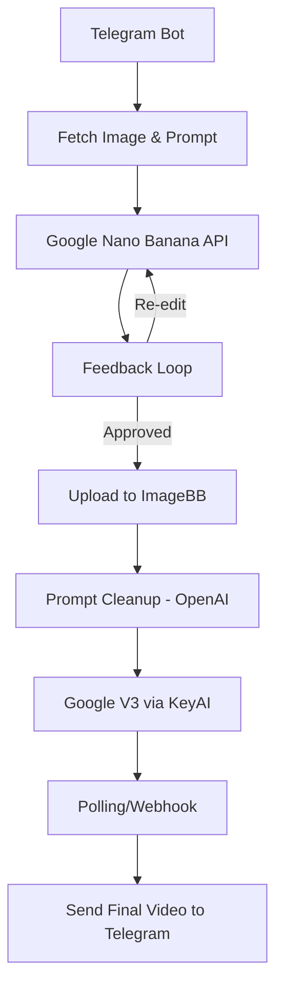

# 🛠️ End-to-End Workflow: Google Nano Banana + V3 (UGC Automation)

This document explains the **complete automation workflow** we built in the video, combining **Google Nano Banana (Gemini 2.5 Flash)** for image editing and **Google V3** for video generation. The orchestration is done using **n8n**, with integrations for **Telegram**, **ImageBB**, and **third-party services (KeyAI/Replicate/FAL)**.

---

## 📌 High-Level Flow

1. **Trigger via Telegram Bot** → Capture user input (image + prompt).
2. **Send Image to Google Nano Banana API** → Perform edits (jacket, backgrounds, etc.).
3. **Feedback Loop** → Allow users to approve or re-edit.
4. **Store Final Image (ImageBB)** → Convert edited image to a shareable URL.
5. **Generate Video (Google V3 via KeyAI)** → Use image + prompt to create an 8s UGC-style video.
6. **Send Output to Telegram** → Deliver final video back to user.

---

## ⚙️ Tech Stack

* 
  **Google Nano Banana (Gemini 2.5 Flash)** for AI-powered **image editing**.

* 
  **n8n** for building and automating the workflow.

---

## 🔄 Detailed Workflow

### 1️⃣ Telegram Trigger

* User sends an **image** + **prompt** to the Telegram bot.
* Example: *“Can you make me wear a jacket with a mountain background?”*

### 2️⃣ Fetching Image from Telegram

* Use Telegram API to fetch the uploaded image file.
* Convert image into **Base64** (as required by Google APIs).

### 3️⃣ Google Nano Banana API Call

* Endpoint: `gemini-2.5-flash-image`
* Input: `Base64 image` + `prompt`
* Output: Edited image in Base64.
* Example: User’s image with **jacket + homestay background**.

### 4️⃣ Feedback Loop

* Send back edited image to user.
* User can:

  * ✅ Approve → Move to video creation.
  * 🔄 Reject/Request edit → Loop back with updated prompt.

### 5️⃣ Upload to ImageBB

* Convert final image → Upload → Get public URL.
* Needed because **V3 video API requires an accessible image URL**.

### 6️⃣ Prompt Processing via OpenAI

* OpenAI GPT used to clean up user feedback.
* Example:

  * Raw: *“Can you add a cowboy hat and make it Western style?”*
  * Cleaned Prompt: *“Generate cinematic scene of cowboy with hat in Wild West setting.”*

### 7️⃣ Google V3 (Video Generation)

* Input: `Image URL` + `prompt`.
* Generated via **KeyAI/Replicate/FAL wrappers** (simpler than raw VertexAI).
* Settings:

  * Model: `v3_fast`
  * Duration: `8s`
  * Ratio: `9:16` (mobile-friendly).

### 8️⃣ Handling Video Response

* Video generation takes **30–120 seconds**.
* Implemented polling/webhook in n8n.
* Once completed → Get video URL.

### 9️⃣ Send Final Video via Telegram

* Bot sends the **final 8s UGC-style video** back to the user.
* Example: User endorsing “Cowboy Lifestyle” with cinematic dialogues.

---

## 📊 Workflow Diagram

---

## 🚀 Key Learnings

* **Nano Banana (Gemini 2.5 Flash)** excels at **iterative image edits** with feedback loops.
* **ImageBB** is critical for converting private assets → public URLs.
* **Prompt cleanup with GPT** ensures reliable inputs for APIs.
* **Google V3** is powerful but **VertexAI setup is complex** → third-party APIs simplify usage.
* **UGC Automation** → Brands/creators can generate **ads, shorts, promos** in minutes.

---

## 📦 Next Steps for Students

* Clone this repo & import the n8n workflow.
* Experiment with **different prompts** (ads, lifestyle, travel, e-commerce).
* Extend workflow with:

  * ✅ WhatsApp/Slack as alternative input channels.
  * ✅ Cloud storage (GCS/S3) instead of ImageBB.
  * ✅ Monetization layer for clients.

---

👉 This workflow demonstrates how **AI + Automation + APIs** can create **real-world business-ready UGC pipelines**. 💡
